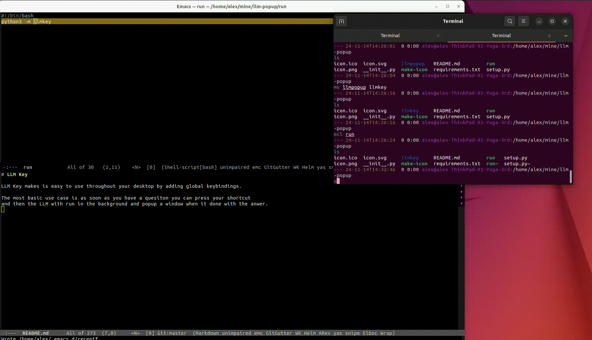

# LLM Key
LLM Key makes it easy to use an LLM, like chatgpt or grok, throughout your desktop by adding shortcuts that run everywhere.

The most basic use case is form asking an LLM questions when they come to mind. LLM Key will call the LLM in the background and popup a window when it is done.  It also copies the answer to the clipboard to be pasted straight away.

You can also copy text to the clipboard and use it in LLM queries.



# Installation
LLM Key is hosted on [pypi](https://pypi.org/project/llmkey/)

In a terminal run:

```bash
sudo apt-get install pipx
pipx install llmkey
llm-key
```

# Usage

- Ctrl-Alt-o propmts you for a query and runs it.
- Ctrl-Alt-c runs a query on the clipboard
- Ctrl-Alt-m displays a menu of options
- You can click on the L icon in the system tray for settings

## Menu 

Ctrl-Alt-m s -- Open settings
Ctrl-Alt-m p -- Peak at the results so far
Ctrl-Alt-m d -- Close the last result window
Ctrl-Alt-m w -- Open a previous window


# Me
If you like this is you can

* Follow me on twitter <a href="https://x.com/readwithai">@readwithai</a></li>
* Read what I have to say <a href="https://readwithai.substack.com">on substack</a></li>
* Pay me 5 dollars on substack: <a href="https://ko-fi.com/readwithai">ko-fi.com</a></li>
